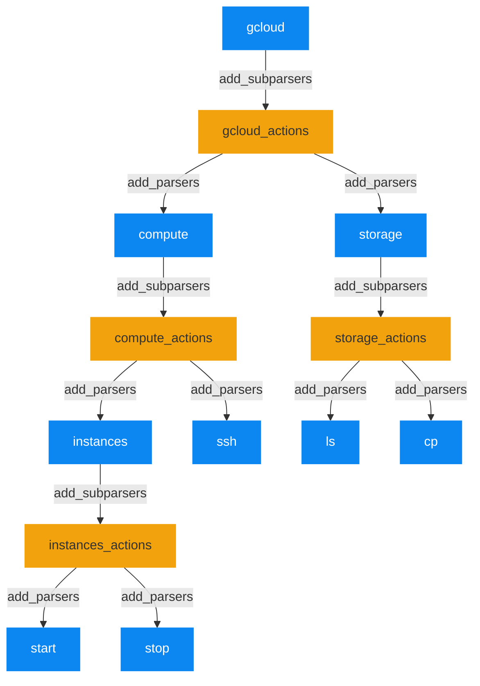

## サブコマンドをネストさせる

- 青い四角が`ArgumentParser`オブジェクト
- 黄色い四角が`_SubParsersAction`オブジェクト

```mermaid
flowchart TD
    classDef Parser fill:#0C87F2,color:#ffffff,stroke-width:0
    classDef SubParsersAction fill:#F2A20C,stroke-width:0

    gcloud:::Parser
    compute:::Parser
    storage:::Parser
    instances:::Parser
    start:::Parser
    stop:::Parser
    ssh:::Parser
    ls:::Parser
    cp:::Parser

    gcloud_actions:::SubParsersAction
    compute_actions:::SubParsersAction
    instances_actions:::SubParsersAction
    storage_actions:::SubParsersAction

    gcloud -->|add_subparsers| gcloud_actions
    gcloud_actions -->|add_parsers| compute
    gcloud_actions -->|add_parsers| storage

    compute -->|add_subparsers| compute_actions
    compute_actions -->|add_parsers| instances
    compute_actions -->|add_parsers| ssh

    instances -->|add_subparsers| instances_actions
    instances_actions -->|add_parsers| start
    instances_actions -->|add_parsers| stop

    storage -->|add_subparsers| storage_actions
    storage_actions -->|add_parsers| ls
    storage_actions -->|add_parsers| cp
```
